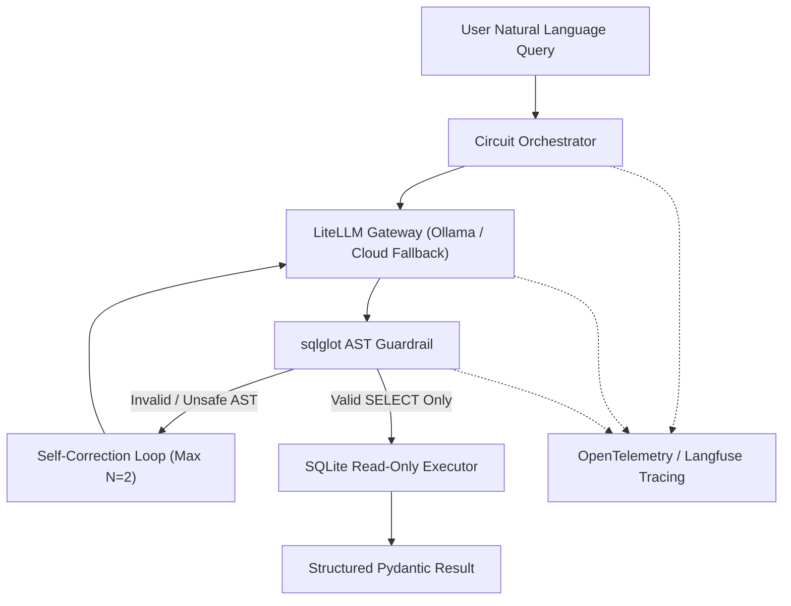

# SQL Circuit Guard

`sql-circuit-guard` is a deterministic, self-correcting Read-Only Text-to-SQL system designed to safely execute natural language queries against relational databases (using SQLite Chinook). It combines local model execution with cloud rate-limited fallback, strict Abstract Syntax Tree (AST) guardrail validation, and robust OpenTelemetry / Langfuse observability.

## Architectural Principles

1. **No Monolithic LLM Frameworks**: Built using native Python, `LiteLLM`, `Pydantic v2`, and `instructor`. No heavy framework abstractions.
2. **Strict Decoupling**: Domain logic never calls vendor SDKs directly. All LLM interactions route through `BaseLLMGateway`.
3. **Deterministic Security**: SQL queries are validated via `sqlglot` AST parsing before touching the database. Security is enforced programmatically, never by prompt trust alone.
4. **Bounded Self-Correction Circuit**: Automatically intercepts AST or execution errors, formats feedback prompts, and retries generation up to $N=2$ turns.
5. **Observability**: Every gateway call and AST verification step is instrumented with OpenTelemetry and Langfuse tracing.

---

## Architecture Flow



---

## User Interface & API Integration

- **Interactive Gradio Web App (`src/app.py`)**:
  - Dual-panel modern design with real-time execution results, formatted SQL blocks, architectural reasoning, and circuit telemetry diagnostics.
  - Quick-click sample prompts for immediate testing.
  - Interactive **Database Schema Explorer** tab to inspect tables (`Artist`, `Album`, `Track`, `Invoice`, etc.) and columns.
  - Dynamic **Langfuse Tracing Toggle** allowing users to enable or disable observability in real time.
- **Robust Integration Testing**:
  - Comprehensive unit test suite covering AST guardrails, circuit loops, database execution, LLM gateway, and telemetry.
  - API integration tests (`tests/test_api_service.py`) ensuring schema inspectors and database executors operate correctly.

---

## 🎥 Live Demo & Multi-Query Walkthrough

## 🎥 Live Demo & Multi-Query Walkthrough


---

## Core Components
- **`guardrails/ast_guard.py`**: Deterministic AST parser (`sqlglot`) ensuring single-statement read-only `SELECT` queries and blocking DDL/DML mutations.
- **`db/executor.py`**: SQLite database executor operating in strict read-only URI mode (`mode=ro`).
- **`db/schema_inspector.py`**: Extracts table schemas and DDL definitions for reliable LLM grounding.
- **`gateway/llm_gateway.py`**: `LiteLLMGateway` supporting local Ollama models (`ibm/granite4.1:8b`) and rate-limited cloud fallback (`gemini-3.1-flash-lite`) via `instructor`.
- **`gateway/rate_limiter.py`**: In-memory Token Bucket rate limiter enforcing Requests Per Minute (RPM) and Tokens Per Minute (TPM) limits.
- **`service/circuit_orchestrator.py`**: Manages the multi-turn self-correction loop and Langfuse trace decoration (`@observe`).
- **`telemetry/tracing.py`**: OpenTelemetry tracing setup with offline resilience for Langfuse.

---

## Installation & Setup

1. **Clone Repository & Prerequisites**
   Ensure Python 3.10+ and `uv` package manager are installed.

2. **Environment Configuration**
   Copy `.env.example` to `.env` and configure your API keys and local endpoint settings:
   ```bash
   cp .env.example .env
   ```

3. **Install Dependencies**
   ```bash
   uv sync
   ```

---

## Running Tests

Run the test suite via `pytest`:
```bash
pytest
```

---

## License

This project is licensed under the terms of the MIT License.
