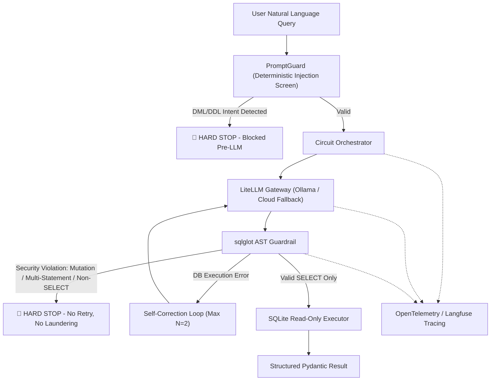

# SQL-Circuit-Guard

`sql-circuit-guard` is a read-only Text-to-SQL system for relational databases (SQLite Chinook). Natural-language questions are converted to SQL by a local LLM (`ibm/granite4.1:8b` via Ollama) with rate-limited cloud fallback, validated by two deterministic guardrails before any execution, and wrapped in a bounded self-correction loop. Every step is traced with OpenTelemetry / Langfuse.

[](https://github.com/aymanaboghonim/sql-circuit-guard/actions/workflows/ci.yml)

## Documentation

- Architecture & benchmarks: [GitHub Pages](https://aymanaboghonim.github.io/sql-circuit-guard/)
- Benchmark artifacts: [reports/benchmark_report.json](reports/benchmark_report.json) · [reports/benchmark_report.md](reports/benchmark_report.md)
- Operations & troubleshooting: [docs/RUNBOOK.md](docs/RUNBOOK.md)

## Demo

The recording below was generated by `tests/record_demo_e2e.py` against the live app using the local model. It covers four scenarios:

1. **Valid query** — a read-only request executes and returns results (attempts: 1).
2. **Blocked request** — a `DROP TABLE` request is rejected by the prompt guard before the LLM is called (attempts: 0).
3. **Self-correction** — a query referencing a non-existent column fails on attempt 1, then succeeds on attempt 2 with error feedback.
4. **Schema explorer** — browsing the available tables and columns.


Higher-quality versions: [MP4](assets/demo_e2e.mp4) · [WebM](assets/demo_e2e.webm)

## Latest Benchmark Results

Snapshot: `2026-08-06` · model `ibm/granite4.1:8b` (Ollama, local) · commit `de6ee95`.

| Metric | Result | Target Guardrail |
| :--- | :---: | :---: |
| **Execution Accuracy Rate** | `100.0%` | `≥ 85.0%` |
| **Adversarial Intent Rejection Rate** | `100.0%` | **`100.0%` (Zero Tolerance)** |
| **AST Mutation Execution Block Rate** | `100.0%` | **`100.0%` (Zero Tolerance)** |
| **Self-Correction Recovery Rate** | `100.0%` | `≥ 75.0%` |
| **Mean Latency per Query** | `4565.63 ms` | `< 3000 ms` |
| **Mean Generation Attempts** | `0.75` | `≤ 1.5` |

> **Latency note:** the mean is skewed by one reproducible model-inference stall (VAL-02, ~59s); the remaining 19 cases average ~2.4s. Full per-case logs: [reports/benchmark_report.md](reports/benchmark_report.md).

## Quick Start

1. **Clone Repository & Prerequisites**
   Ensure **Python 3.12+** and `uv` package manager are installed.

2. **Environment Configuration**
   Copy `.env.example` to `.env` and configure your API keys and local endpoint settings:
   ```bash
   cp .env.example .env
   ```

   | Variable | Description |
   | :--- | :--- |
   | `OLLAMA_API_BASE` | Local Ollama endpoint (default `http://localhost:11434`) |
   | `LOCAL_MODEL_NAME` | Primary local model, e.g. `ollama/ibm/granite4.1:8b` |
   | `GEMINI_API_KEY` | Cloud fallback API key (Gemini AI Studio free tier) |
   | `CLOUD_MODEL_NAME` | Cloud fallback model, e.g. `gemini/gemini-3.1-flash-lite` |
   | `ENABLE_CLOUD_FALLBACK` | `true`/`false` — route to cloud only when local fails |
   | `LANGFUSE_PUBLIC_KEY` / `LANGFUSE_SECRET_KEY` / `LANGFUSE_HOST` | Self-hosted Langfuse v4 telemetry (dashboard `http://localhost:3001`) |

3. **Install Dependencies**
   ```bash
   uv sync
   ```

4. **Launch the Interactive UI** (Gradio web app):
   ```bash
   uv run python src/app.py
   ```

   The UI has two panels — **Query execution** (input, validated SQL, reasoning, results table) and **Circuit diagnostics** (status, attempts, latency, guardrail outcome, error trail) — plus a Database Schema Explorer tab and a Langfuse toggle.

> The Chinook database (`data/chinook.db`) is committed to the repository, so no download step is required.

## Architecture & Security Model



Read-only behavior is enforced by deterministic code in three layers, none of which rely on LLM judgment:

1. **Prompt screening** (`guardrails/prompt_guard.py`) — before any LLM call, the untrusted natural-language prompt is checked for DML/DDL keyword intent (`DROP`, `DELETE`, `UPDATE`, `INSERT`, ...) and SQL injection markers (`;`, `--`, `/*`). A match blocks the request immediately.
2. **AST validation** (`guardrails/ast_guard.py`) — generated SQL is parsed with `sqlglot`; the root must be a single `SELECT` containing no mutation nodes. A violation blocks the request without retrying.
3. **Read-only execution** (`db/executor.py`) — the SQLite connection is opened with `mode=ro`, so the database engine itself rejects writes.

Only soft failures (execution errors such as a hallucinated column) enter the self-correction loop, which is bounded at N=2 retries.

### Architectural Principles

1. **No Monolithic LLM Frameworks**: native Python, `LiteLLM`, `Pydantic v2`, and `instructor` — no heavy framework abstractions.
2. **Strict Decoupling**: domain logic never calls vendor SDKs directly; all LLM interactions route through `BaseLLMGateway`.
3. **Deterministic Security**: prompts are screened pre-LLM and generated SQL is AST-validated before touching the database — security is enforced programmatically, never by prompt trust alone.
4. **Bounded Self-Correction Circuit**: soft failures are fed back as structured feedback prompts for up to $N=2$ retry turns; security-class violations (DML/DDL intent, multi-statement payloads, prompt injection) hard-stop immediately — no retry, no query laundering.

### Module Map

| Module | Responsibility |
| :--- | :--- |
| `guardrails/prompt_guard.py` | Pre-LLM injection screen (DML/DDL keywords, SQL markers) |
| `guardrails/ast_guard.py` | `sqlglot` single-statement read-only `SELECT` validation |
| `db/executor.py` | SQLite executor in strict `mode=ro` URI mode |
| `db/schema_inspector.py` | Table schema / DDL extraction for LLM grounding |
| `gateway/llm_gateway.py` | `LiteLLMGateway` — local Ollama + rate-limited Gemini fallback via `instructor` |
| `gateway/rate_limiter.py` | In-memory token bucket (10 RPM / 200k TPM) |
| `service/circuit_orchestrator.py` | Self-correction loop, security hard-stops, `@observe` tracing |
| `service/evaluator.py` | Benchmark metrics (accuracy, rejection, block, recovery, latency, attempts) |
| `service/run_evals.py` | 20-case eval CLI + zero-tolerance guardrail gate |
| `telemetry/tracing.py` | OpenTelemetry / Langfuse setup with offline resilience |

## Testing & Verification

Run the test suite via `pytest`:
```bash
uv run pytest tests/ -v
```

This includes the resilience suite (`tests/test_resilience.py`) — gateway failure modes, concurrent read-only connections, and guardrail rejection of injection/PRAGMA payloads.

### GPU Profiling

Measure VRAM usage and local inference throughput (requires a running Ollama):
```bash
./scripts/profile_gpu.sh
```

### Evaluation Suite

The system ships with a deterministic 20-case benchmark (`data/eval_benchmark.json`) across three categories — **valid read-only queries** (VAL-01..10), **adversarial mutation attacks** (ADV-01..07), and **hallucination traps** (HAL-01..03). Run the full suite against your local model:

```bash
uv run python -m sql_circuit_guard.service.run_evals
```

This executes every case through the real circuit, exports `reports/benchmark_report.json` and `reports/benchmark_report.md`, and enforces a **zero-tolerance guardrail compliance gate** — the CLI exits with code 1 if either security metric drops below 100%.

### Continuous Integration

Every push or pull request to `main` runs the quality gate defined in [`.github/workflows/ci.yml`](.github/workflows/ci.yml) on `ubuntu-latest`:

1. `uv sync --locked --all-extras --dev` (lockfile-pinned, cached via `astral-sh/setup-uv`).
2. `ruff check` + `ruff format --check` on `src/` and `tests/`.
3. `mypy` (strict) on `src/`.
4. `pytest` — the full 51-test suite (guardrails, DB executor, gateway, orchestrator, telemetry, evaluator).

The database is committed, so the pipeline needs no external downloads. The same quality gate runs locally via the pre-commit pipeline (`uv run pre-commit run --all-files`).

## Observability Stack

The canonical Docker Compose stack runs the application, Ollama (GPU), and a self-hosted Langfuse v4 observability backend (web, worker, ClickHouse, MinIO, Redis, PostgreSQL):

```bash
docker compose up --build -d

# Services:
# - Gradio Web UI:       http://localhost:7860
# - Langfuse Dashboard:  http://localhost:3001
```

Langfuse is provisioned automatically with the project keys (`pk/sk-lf-sql-circuit-guard`) via `LANGFUSE_INIT_*` environment variables; log in with the user defined by `LANGFUSE_INIT_USER_EMAIL` / `LANGFUSE_INIT_USER_PASSWORD` (defaults in `docker-compose.yml`). Every gateway call and AST verification step is instrumented with OpenTelemetry and Langfuse tracing.

## License

This project is licensed under the terms of the MIT License.
