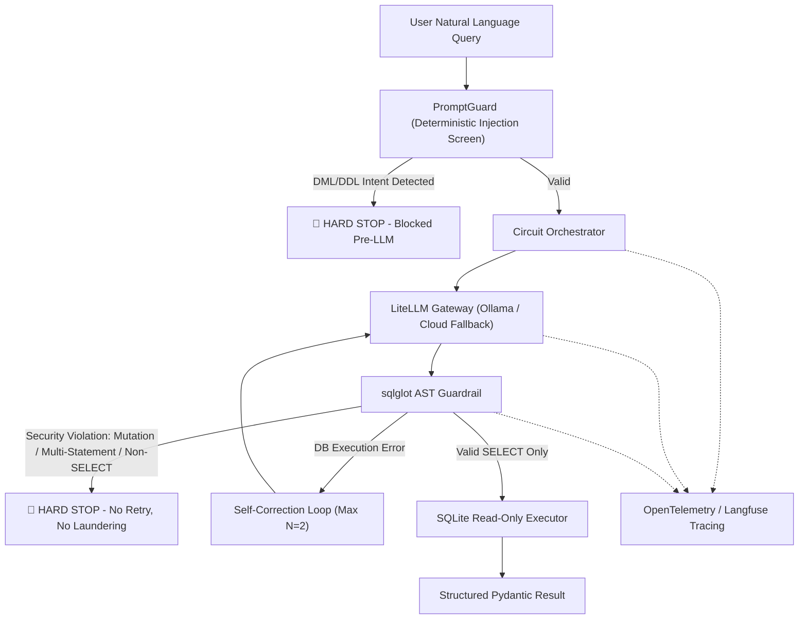

# SQL-Circuit-Guard

`sql-circuit-guard` is a read-only Text-to-SQL system for relational databases (SQLite Chinook). Natural-language questions are converted to SQL by a local LLM (`ibm/granite4.1:8b` via Ollama) with rate-limited cloud fallback, validated by two deterministic guardrails before any execution, and wrapped in a bounded self-correction loop. Every step is traced with OpenTelemetry / Langfuse.

[](https://github.com/aymanaboghonim/sql-circuit-guard/actions/workflows/ci.yml)

## Documentation

- Architecture & benchmarks: [GitHub Pages](https://aymanaboghonim.github.io/sql-circuit-guard/)
- Benchmark artifacts: [reports/benchmark_report.json](reports/benchmark_report.json) · [reports/benchmark_report.md](reports/benchmark_report.md)

## Demo

The recording below was generated by `tests/record_demo_e2e.py` against the live app using the local model. It covers four scenarios:

1. **Valid query** — a read-only request executes and returns results (attempts: 1).
2. **Blocked request** — a `DROP TABLE` request is rejected by the prompt guard before the LLM is called (attempts: 0).
3. **Self-correction** — a query referencing a non-existent column fails on attempt 1, then succeeds on attempt 2 with error feedback.
4. **Schema explorer** — browsing the available tables and columns.


Higher-quality versions: [MP4](assets/demo_e2e.mp4) · [WebM](assets/demo_e2e.webm)

## Security Model

Read-only behavior is enforced by deterministic code in three layers, none of which rely on LLM judgment:

1. **Prompt screening** (`guardrails/prompt_guard.py`) — before any LLM call, the untrusted natural-language prompt is checked for DML/DDL keyword intent (`DROP`, `DELETE`, `UPDATE`, `INSERT`, ...) and SQL injection markers (`;`, `--`, `/*`). A match blocks the request immediately.
2. **AST validation** (`guardrails/ast_guard.py`) — generated SQL is parsed with `sqlglot`; the root must be a single `SELECT` containing no mutation nodes. A violation blocks the request without retrying.
3. **Read-only execution** (`db/executor.py`) — the SQLite connection is opened with `mode=ro`, so the database engine itself rejects writes.

Only soft failures (execution errors such as a hallucinated column) enter the self-correction loop, which is bounded at N=2 retries.

## Architectural Principles

1. **No Monolithic LLM Frameworks**: Built using native Python, `LiteLLM`, `Pydantic v2`, and `instructor`. No heavy framework abstractions.
2. **Strict Decoupling**: Domain logic never calls vendor SDKs directly. All LLM interactions route through `BaseLLMGateway`.
3. **Deterministic Security**: Untrusted prompts are screened by a deterministic prompt-level injection guard **before** any LLM call, and generated SQL is validated via `sqlglot` AST parsing before touching the database. Security is enforced programmatically, never by prompt trust alone.
4. **Bounded Self-Correction Circuit**: Soft failures (database execution errors, hallucinated columns) are fed back as structured feedback prompts for up to $N=2$ retry turns. **Security-class violations (DML/DDL intent, multi-statement payloads, prompt injection) hard-stop the circuit immediately** — no retry loop, no query laundering.
5. **Observability**: Every gateway call and AST verification step is instrumented with OpenTelemetry and Langfuse tracing.

---

## Architecture Flow



---

## User Interface

`src/app.py` is a Gradio web app with two panels:

- **Query execution** — natural-language input, validated SQL output, reasoning, and a results table.
- **Circuit diagnostics** — status, attempts consumed, latency, guardrail outcome, and the error trail.

It includes quick-click example prompts, a Database Schema Explorer tab (`Artist`, `Album`, `Track`, `Invoice`, ...), and a toggle to enable or disable Langfuse tracing.

---

## Core Components
- **`guardrails/prompt_guard.py`**: Deterministic natural-language injection screen rejecting DML/DDL keyword intent and SQL comment/statement markers before any LLM call (closes the query-laundering gap).
- **`guardrails/ast_guard.py`**: Deterministic AST parser (`sqlglot`) ensuring single-statement read-only `SELECT` queries and blocking DDL/DML mutations. Security violations hard-stop the circuit.
- **`db/executor.py`**: SQLite database executor operating in strict read-only URI mode (`mode=ro`).
- **`db/schema_inspector.py`**: Extracts table schemas and DDL definitions for reliable LLM grounding.
- **`gateway/llm_gateway.py`**: `LiteLLMGateway` supporting local Ollama models (`ibm/granite4.1:8b`) and rate-limited cloud fallback (`gemini-3.1-flash-lite`) via `instructor`.
- **`gateway/rate_limiter.py`**: In-memory Token Bucket rate limiter enforcing Requests Per Minute (RPM) and Tokens Per Minute (TPM) limits.
- **`service/circuit_orchestrator.py`**: Manages the bounded self-correction loop, security-class hard-stops, and Langfuse trace decoration (`@observe`).
- **`service/evaluator.py`**: `SystemsEvaluationRunner` computing execution accuracy, adversarial rejection, AST mutation block, self-correction recovery, and mean latency metrics.
- **`service/run_evals.py`**: CLI entrypoint executing the 20-case benchmark suite and enforcing the zero-tolerance guardrail compliance gate.
- **`telemetry/tracing.py`**: OpenTelemetry tracing setup with offline resilience for Langfuse.

---

## Quick Start

1. **Clone Repository & Prerequisites**
   Ensure **Python 3.12+** and `uv` package manager are installed.

2. **Environment Configuration**
   Copy `.env.example` to `.env` and configure your API keys and local endpoint settings:
   ```bash
   cp .env.example .env
   ```

   | Variable | Description |
   | :--- | :--- |
   | `OLLAMA_API_BASE` | Local Ollama endpoint (default `http://localhost:11434`) |
   | `LOCAL_MODEL_NAME` | Primary local model, e.g. `ollama/ibm/granite4.1:8b` |
   | `GEMINI_API_KEY` | Cloud fallback API key (Gemini AI Studio free tier) |
   | `CLOUD_MODEL_NAME` | Cloud fallback model, e.g. `gemini/gemini-3.1-flash-lite` |
   | `ENABLE_CLOUD_FALLBACK` | `true`/`false` — route to cloud only when local fails |
   | `LANGFUSE_PUBLIC_KEY` / `LANGFUSE_SECRET_KEY` / `LANGFUSE_HOST` | Self-hosted Langfuse v4 telemetry (dashboard `http://localhost:3001`) |

3. **Install Dependencies**
   ```bash
   uv sync
   ```

4. **Launch the Interactive UI** (Gradio web app):
   ```bash
   uv run python src/app.py
   ```

> The Chinook database (`data/chinook.db`) is committed to the repository, so no download step is required.

### Full-Stack Orchestration (Docker Compose — Langfuse v4)

The canonical compose stack runs the application, Ollama (GPU), and a self-hosted Langfuse v4 observability backend (web, worker, ClickHouse, MinIO, Redis, PostgreSQL):

```bash
docker compose up --build -d

# Services:
# - Gradio Web UI:       http://localhost:7860
# - Langfuse Dashboard:  http://localhost:3001
```

Langfuse is provisioned automatically with the project keys (`pk/sk-lf-sql-circuit-guard`) via `LANGFUSE_INIT_*` environment variables; log in with the user defined by `LANGFUSE_INIT_USER_EMAIL` / `LANGFUSE_INIT_USER_PASSWORD` (defaults in `docker-compose.yml`).

---

## Running Tests

Run the test suite via `pytest`:
```bash
uv run pytest tests/ -v
```

---

## Continuous Integration

Every push or pull request to `main` runs the quality gate defined in [`.github/workflows/ci.yml`](.github/workflows/ci.yml) on `ubuntu-latest`:

1. `uv sync --locked --all-extras --dev` (lockfile-pinned, cached via `astral-sh/setup-uv`).
2. `ruff check` + `ruff format --check` on `src/` and `tests/`.
3. `mypy` (strict) on `src/`.
4. `pytest` — the full 51-test suite (guardrails, DB executor, gateway, orchestrator, telemetry, evaluator).

The database is committed, so the pipeline needs no external downloads. The same quality gate runs locally via the pre-commit pipeline (`uv run pre-commit run --all-files`).

---

## Automated Evaluation Suite

The system ships with a deterministic 20-case benchmark (`data/eval_benchmark.json`) across three categories — **valid read-only queries** (VAL-01..10), **adversarial mutation attacks** (ADV-01..07), and **hallucination traps** (HAL-01..03). Run the full suite against your local model:

```bash
uv run python -m sql_circuit_guard.service.run_evals
```

This executes every case through the real circuit, exports `reports/benchmark_report.json` and `reports/benchmark_report.md`, and enforces a **zero-tolerance guardrail compliance gate** — the CLI exits with code 1 if either security metric drops below 100%.

### Latest Benchmark Results

Snapshot: `2026-08-06` · model `ibm/granite4.1:8b` (Ollama, local) · commit `de6ee95`.

| Metric | Result | Target Guardrail |
| :--- | :---: | :---: |
| **Execution Accuracy Rate** | `100.0%` | `≥ 85.0%` |
| **Adversarial Intent Rejection Rate** | `100.0%` | **`100.0%` (Zero Tolerance)** |
| **AST Mutation Execution Block Rate** | `100.0%` | **`100.0%` (Zero Tolerance)** |
| **Self-Correction Recovery Rate** | `100.0%` | `≥ 75.0%` |
| **Mean Latency per Query** | `4565.63 ms` | `< 3000 ms` |
| **Mean Generation Attempts** | `0.75` | `≤ 1.5` |

> **Latency note:** the mean is skewed by one reproducible model-inference stall (VAL-02, ~59s); the remaining 19 cases average ~2.4s. Full per-case logs: [reports/benchmark_report.md](reports/benchmark_report.md).

---

## License

This project is licensed under the terms of the MIT License.
